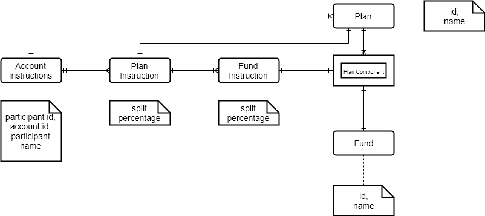

# account-instruction-service

Account Instruction service provides the operations with the account contribution instructions sub-domain for the group pension plan domain.

The operations are:
1. Set contribution instrutions for an account
2. Set fund instructions for an account within the plan.
3. Get the current instructions for the account.

To be able to work properly, when a new account is created, default contribution and fund split instructions must be set. This also implies that this service needs to maintain the plan & fund details.

## Entity Model

